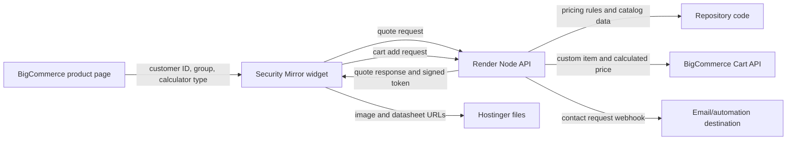

# Security Mirror Calculator: Client Handover Guide

This guide explains the calculator system, its external connections, and the safe way to maintain it after handover.

## 1. System Overview

The calculator is an in-house replacement for Calculator Studio and Grid. The browser displays the calculator, but the server is responsible for the authoritative price and cart validation.



### Systems and responsibilities

| System | Responsibility | What should be changed there |
|---|---|---|
| GitHub repository | Source code, widget, tests, theme snippets, deployment history | All calculator logic and configuration changes |
| Render | Runs the Node API and serves the widget files | Environment variables, deploys, logs |
| BigCommerce | Product pages, customer groups, product templates, carts | Product/template assignment and store credentials |
| Hostinger | Product images and English/French datasheet PDFs | Upload/replace media files |
| Excel workbook | Business reference and original Calculator Studio rules | Use for verification; it is not loaded dynamically at runtime |

The current repository is:

```text
/Users/prateekrana/Documents/GitHub/Bigcommerce
```

The GitHub remote is `https://github.com/Prateek-sustainble/Bigcommerce.git` on branch `main`.

## 2. Important Source Files

| File | Purpose |
|---|---|
| `src/server.js` | HTTP API, CORS, quote route, contact route, cart route |
| `src/calculators/index.js` | Calculator dispatch and supported calculator types |
| `src/calculators/workbookProducts.js` | Most product configurations and workbook-derived formulas |
| `src/calculators/framelessMirror.js` | Frameless Mirror calculator |
| `src/data/common.js` | Customer discounts and shared pricing constants |
| `src/data/skuCatalog.js` | Fixed-size catalog rows and customer prices |
| `src/data/workbookImageAssets.js` | Hostinger image filename and option mappings |
| `public/security-mirror-widget.js` | BigCommerce browser widget and form/cart behavior |
| `public/security-mirror-widget.css` | Widget styling |
| `src/bigcommerce.js` | BigCommerce Cart API request and cart image selection |
| `src/access.js` | Login/cart access rules |
| `src/quoteToken.js` | Signed quote-token creation and verification |
| `test/*.test.js` | Regression tests |
| `docs/bigcommerce-frameless-snippet.html` | Embed example for a Stencil product template |
| `render.yaml` | Render service defaults and required environment variables |

## 3. Production Connections

### Render service

The production API and widget base URL is:

```text
https://security-mirror-calculator.onrender.com
```

The important endpoints are:

```text
GET  /health
GET  /api/calculator/config?type=series_850
POST /api/calculator/quote
POST /api/contact/request
POST /api/cart/add
GET  /security-mirror-widget.js
GET  /security-mirror-widget.css
```

Use `/api/calculator/config`, not `/api/config`.

### Render environment variables

Set these in the Render service under **Environment**. Do not put secrets in GitHub, the BigCommerce theme, or browser JavaScript.

| Variable | Required | Purpose |
|---|---:|---|
| `NODE_ENV` | Yes | Set to `production` |
| `ALLOWED_ORIGIN` | Yes | BigCommerce storefront origin(s), comma-separated when needed |
| `QUOTE_SIGNING_SECRET` | Yes | Long random secret used to sign quotes |
| `REQUIRE_QUOTE_TOKEN` | Yes | Set to `true` in production |
| `BIGCOMMERCE_STORE_HASH` | For cart | BigCommerce store hash |
| `BIGCOMMERCE_ACCESS_TOKEN` | For cart | Store-level API token with cart modification permission |
| `BIGCOMMERCE_CART_CURRENCY` | Recommended | `CAD` for this store |
| `PUBLIC_BASE_URL` | Optional | Public API URL used to make relative cart images absolute |
| `CONTACT_REQUEST_WEBHOOK_URL` | For contact delivery | Webhook that receives contact requests |
| `CONTACT_REQUEST_EMAIL_TO` | Informational fallback | Recipient reported in the 501 error if no webhook is configured |

Example non-secret values:

```text
NODE_ENV=production
ALLOWED_ORIGIN=https://securitymirror.com,https://your-store.mybigcommerce.com
REQUIRE_QUOTE_TOKEN=true
BIGCOMMERCE_CART_CURRENCY=CAD
PUBLIC_BASE_URL=https://security-mirror-calculator.onrender.com
CONTACT_REQUEST_EMAIL_TO=craigbigcommerce@gmail.com,craigb@securitymirror.com
```

`CONTACT_REQUEST_EMAIL_TO` alone does **not** send email. Contact submissions are delivered only when `CONTACT_REQUEST_WEBHOOK_URL` is configured. The webhook can be a company automation endpoint, Make/Zapier webhook, Power Automate flow, or a small email relay.

### BigCommerce connection

The server uses the BigCommerce V3 Cart API to create a custom cart item. The item uses:

- the calculated description;
- the calculated SKU;
- the calculated quantity;
- the calculated CAD or USD price;
- the selected primary image URL.

The browser never sends a trusted price directly to BigCommerce. The server recalculates the quote and verifies the signed quote token first.

The BigCommerce store-level API token is read only by Render. If it is rotated, update `BIGCOMMERCE_ACCESS_TOKEN` in Render and redeploy/restart the service.

## 4. BigCommerce Product Templates

Each product family must use a template containing the calculator embed. The important attribute is:

```html
data-sm-type="series_850"
```

Supported calculator types currently include:

```text
frameless_mirror
cut_glass
shelves
series_855
series_3205
kick_plates
antique
u_guard
corner_guard
j_mould
series_850
series_850_ft
series_3200
series_3200_ft
series_3300
series_4100
convex_domes
```

The embed also passes the logged-in BigCommerce context:

```html
data-sm-customer-group="{{#if customer}}{{customer.customer_group_name}}{{else}}Guest{{/if}}"
data-sm-customer-id="{{#if customer}}{{customer.id}}{{/if}}"
```

Do not trust a customer-group query string in production. Query-string customer groups are intended only for local demos; production uses the BigCommerce theme context.

### Add a new product-family template

1. Copy the original theme's `templates/pages/product.html` to a new file under `templates/pages/custom/product/`.
2. Keep the existing visual/layout markup unchanged.
3. Add the widget embed from `docs/bigcommerce-frameless-snippet.html`.
4. Change only `data-sm-type` and the `type` option if present.
5. Upload the **complete theme**, not just the changed template.
6. In BigCommerce, edit the product and select **Other Details -> Template Layout File**.
7. Choose the matching path, for example `pages/custom/product/series-3200-ft.html`.
8. Preview the product before activating the theme.

### Avoiding TR-600/TR-601 theme upload errors

The zip must be made from the theme root and must include the complete original theme structure, including `config.json`, `schema.json`, `assets/`, `lang/`, `templates/`, and other theme directories.

The zip should open directly to the theme files, not to an extra outer folder such as `theme-fix/theme-fix/...`.

Inside `templates/`, use BigCommerce-parsed `.html` template files only. Do not place `.js`, `.css`, `.json`, or other non-template files in the `templates/` directory.

Before uploading, inspect the archive:

```sh
cd /path/to/full/theme/root
zip -r ../security-mirror-theme.zip .
unzip -l ../security-mirror-theme.zip | head -80
```

Keep the currently active theme unchanged until the new theme has been previewed and tested.

## 5. Customer Groups and Access Rules

### How a price is calculated

For a normal workbook/catalog product:

```text
customer price = list/base price for the selected options × customer-group multiplier
```

The multipliers are decimal factors, not discount percentages:

```text
0.70 = customer pays 70% of list price = 30% discount
0.45 = customer pays 45% of list price = 55% discount
1.00 = no discount
```

The backend is authoritative. BigCommerce's normal product price and price lists do not replace the calculated custom-item price.

### Current discount location

Edit `src/data/common.js`, in `CUSTOMER_DISCOUNTS`.

Example:

```js
Contractor: {
  series_850: 0.7,
  // ...
}
```

To change Series 850 Contractor pricing from 30% off to 35% off, use:

```js
series_850: 0.65
```

Use the exact group names used by BigCommerce: `Guest`, `Contractor`, `House`, `Special`, `Elite`, `Platinum`, and `Richelieu`. If a new group is added, update the group options and every calculator discount map deliberately. Do not rely on a misspelled group name.

### Guest and logged-out behavior

- Logged-out visitors have no customer ID and receive Guest pricing.
- Customers in the `Guest` group also receive Guest pricing.
- Guest-priced calculators cannot be added to cart.
- A logged-in customer in a non-Guest group can add the calculated item to cart.
- The contact form is shown for logged-out and Guest-group visitors.

The login check is in `src/access.js`. Do not remove it merely because the Add to Cart button is visible; the server must continue to enforce the rule.

## 6. Changing Prices and Formulas

First decide which kind of price is being changed.

### A. Customer discount only

Change `src/data/common.js` as described above. Do not change product base prices.

### B. Fixed catalog price

Fixed size/option rows are stored in `src/data/skuCatalog.js`. A catalog row contains its SKU, options, description, and customer-group prices.

If a row price is changed, update the appropriate row for every required customer group. Confirm that the row's option labels exactly match the widget selections. A label mismatch makes the calculator miss the row and fall back to a custom calculation or unavailable state.

Because this file is large and generated-style data, use a precise edit and add a regression test. Do not perform broad search-and-replace across the file.

### C. Formula-driven/custom price

Formula-driven calculators are in `src/calculators/workbookProducts.js`, with shared constants near the top of that file and shared discounts in `src/data/common.js`.

Typical examples:

- square-foot pricing uses normalized dimensions and a PSF/base rule;
- glazing adds a per-square-foot amount or selects a different base table;
- frame finishing applies a finish-specific surcharge;
- packaging, shelf, guard, hole, tape, edge, or shatter-stop choices add their own amounts;
- custom dimensions may use workbook minimum/maximum rules and stock-size detection.

The Excel workbook is a reference, not a live API. Editing Excel alone does not change production. The corresponding JavaScript formula must be changed, tested, committed, and deployed.

### Safe price-change workflow

1. Record the original workbook inputs and expected price.
2. Identify the calculator type and exact option combination.
3. Find the formula or constant in `src/calculators/workbookProducts.js`.
4. Change the smallest possible expression or constant.
5. Add a regression test in `test/workbookProducts.test.js`.
6. Run `npm test`.
7. Test the quote API directly.
8. Push to GitHub and wait for Render to deploy.
9. Recheck the same combination in the BigCommerce product page.

For any price change, check at least Guest, Contractor, House, Special, Elite, and Platinum where that family supports them.

### Example API price test

```sh
curl -sS -X POST \
  https://security-mirror-calculator.onrender.com/api/calculator/quote \
  -H 'content-type: application/json' \
  --data '{
    "type":"series_850",
    "customerGroup":"Special",
    "customerId":123,
    "width":24,
    "height":36,
    "glazing":"5mm Standard",
    "frameFinishing":"Brushed Steel Gold",
    "shelf":"No Shelf",
    "packaging":"Standard Packaging",
    "quantity":1
  }'
```

Inspect `calculation`, `price`, `customerGroup`, `discountMultiplier`, `sku`, and `description` in the response.

### Special note for 3200FT

The 3200FT implementation distinguishes stock dimensions from custom dimensions. It also applies the selected glazing and frame-finish rules. When changing it, test both:

- a stock-like size such as `24 x 36`;
- a custom size such as `24-1/4 x 36`;
- each supported frame finish;
- each glazing choice;
- non-zero width and height fractions.

Do not add a generic minimum-price clamp unless the workbook explicitly contains one. A clamp can hide a wrong base-price or custom-size formula.

## 7. Adding or Changing Images

### Hostinger image rules

Images are served from:

```text
https://saddlebrown-turkey-900185.hostingersite.com/Images/
```

Filenames are case-sensitive. A URL that differs by one character, hyphen, underscore, or letter case will fail.

The image mapping is in `src/data/workbookImageAssets.js`. A numbered image set looks like:

```js
"Brushed Steel Gold": numberedAssetSet(
  "SERIES_850_PICTURE_URL_LOWER_CASE-BRUSHED-STEEL-GOLD",
  [1, 4, 5, 6],
),
```

That produces URLs ending in `-1.png`, `-4.png`, `-5.png`, and `-6.png`. The first gallery item is used as the primary display image and as the cart image. The fallback placeholder should not be inserted into the normal gallery.

### Replace an existing image

1. Upload the replacement to the same Hostinger folder.
2. Keep the exact existing filename if no code change is desired.
3. Open the full URL in a browser to verify it loads.
4. Clear browser cache or use a private window.
5. Check both the main image and cart image.

### Add a new image to an existing option

1. Upload the new file using the same naming convention.
2. Add its number to the array in `workbookImageAssets.js`.
3. Put the primary image first in the index array.
4. Do not include the old default product image if it causes overlap.
5. Run the widget and click every gallery thumbnail.

Example:

```js
"18GA Brushed Steel": numberedAssetSet(
  "U_GUARDS_18GA_BRUSHED_STEEL",
  [1, 2, 3],
),
```

### Add images for a new option

The option label must be identical in both places:

1. The calculator config in `src/calculators/workbookProducts.js`.
2. The variant key in `src/data/workbookImageAssets.js`.

For example, `18GA Brushed Steel` and `18ga Brushed Steel` are different JavaScript keys. Use the exact label returned by `/api/calculator/config`.

If a family uses a frame-finish swatch, update all of these together:

- option list;
- swatch map;
- formula/surcharge map;
- SKU or description mapping if applicable;
- Hostinger asset map;
- regression test.

### Verify media URLs

```sh
curl -L -I 'https://saddlebrown-turkey-900185.hostingersite.com/Images/example.png'
```

Use `curl -L` and inspect the final HTTP status. A successful code is normally `200`.

## 8. Datasheets

English files are served from `/datasheet/`; French files are served from `/datasheet_fr/`, both under the Hostinger base domain.

The standard family filename map is `DATASHEET_FILE_NAMES` in `src/calculators/workbookProducts.js`. Examples:

```js
SERIES_850: "Datasheet_850.pdf",
SERIES_850_FT: "Datasheet_850FT.pdf",
SERIES_855: "Datasheet_855-Steel-Shelf.pdf",
```

To add a new standard family:

1. Upload the English PDF to `/datasheet/`.
2. Upload the French PDF to `/datasheet_fr/` with the `_FR` suffix.
3. Add the family key and English filename to `DATASHEET_FILE_NAMES`.
4. Confirm the generated French name is correct, or add a family-specific mapping.
5. Test both links from the calculator.

Convex and dome datasheets are generated from the selected category by converting it to uppercase and replacing spaces with underscores. For example:

```text
Indoor Acrylic Convex Mirror
-> /datasheet/INDOOR_ACRYLIC_CONVEX_MIRROR.pdf
-> /datasheet_fr/INDOOR_ACRYLIC_CONVEX_MIRROR_FR.pdf
```

## 9. Adding a New Product Family

1. Add the calculator type name to the appropriate configuration/dispatch path.
2. Add its fields and defaults to `CUSTOM_CONFIGS` in `workbookProducts.js`.
3. Add its calculator function to `CUSTOM_CALCULATORS`, or add a catalog family to `SKU_CATALOG` if it is fixed catalog data.
4. Add the family to `CUSTOMER_DISCOUNTS` for every supported customer group.
5. Add formula constants, finish surcharges, option restrictions, and SKU/description rules.
6. Add Hostinger image mappings in `workbookImageAssets.js`.
7. Add datasheet mappings and upload English/French PDFs.
8. Add tests for default values, every option, fractions/custom size behavior, each finish, and customer-group pricing.
9. Create a BigCommerce custom product template with the new `data-sm-type`.
10. Assign that template to the matching BigCommerce product.
11. Deploy Render, then test the API before testing the storefront.

Do not add a new family only by changing the BigCommerce product name. The backend must recognize the `type` or it will return `Unsupported calculator type`.

## 10. Local Development and Testing

Requirements: Node.js 20 or newer.

```sh
cd /Users/prateekrana/Documents/GitHub/Bigcommerce
npm install
npm test
npm start
```

Open `http://localhost:3000/`. Local demo customer-group overrides are available, for example:

```text
http://localhost:3000/?type=series_850&cg=Special
```

These URL overrides are intentionally disabled on production storefronts.

### Workbook inspection tools

The workbook inspection tools use the bundled spreadsheet runtime and currently point to the reference workbook path inside the scripts:

```sh
node tools/inspect_pricing_workbook.mjs
node tools/extract_pricing_model.mjs
node tools/extract_product_formulas.mjs
node tools/summarize_skus.mjs
```

They write inspection output under `outputs/security-mirror-inspection/`. Generated inspection output is for analysis, not production application data.

### Minimum regression test set

Before deployment, test:

- default quote for every supported family;
- customer groups Guest, Contractor, House, Special, Elite, and Platinum;
- logged-out contact flow;
- logged-in add-to-cart flow;
- stock and custom dimensions where supported;
- every fraction control supported by the workbook;
- every glazing, finish, shelf, packaging, guard, edge, hole, tape, and shatter-stop option;
- image changes and all gallery thumbnails;
- English and French datasheet links.

## 11. Deployment Workflow

### Render/API changes

```sh
cd /Users/prateekrana/Documents/GitHub/Bigcommerce
npm test
git diff --check
git status
git add src public test docs README.md
git commit -m "Update calculator pricing or assets"
git push origin main
```

Render is connected to GitHub and deploys from `main`. After pushing:

1. Open the Render service.
2. Watch deploy logs until the service is live.
3. Confirm `https://security-mirror-calculator.onrender.com/health` returns `{ "ok": true }`.
4. Test the affected config and quote request.
5. Test the BigCommerce product page.

If Render reports `Exited with status 1`, read the first JavaScript syntax/error line. Common causes are duplicate `const` declarations after a manual merge, a missing comma, or a mismatched brace. Run `npm test` locally before pushing again.

### BigCommerce theme changes

Theme deployment is separate from Render deployment. Upload the complete theme zip, preview it, assign the custom templates, and activate only after verification. A Render code deploy does not automatically change a BigCommerce theme template, and a theme upload does not change Render calculator code.

## 12. Troubleshooting

| Symptom | Check first |
|---|---|
| All groups show the same price | Inspect `data-sm-customer-group` and `data-sm-customer-id`; confirm the label matches `CUSTOMER_DISCOUNTS` |
| Price is `0.00` | Inspect the quote response for an unsupported option combination or formula error |
| `frameSurchargeRate is not defined` | Check for a duplicate/missing local declaration in the affected calculator; run `npm test` |
| Calculator does not appear | Confirm the product uses the correct custom template and `data-sm-type`; check the Render script URL |
| `/api/config` returns Not Found | Use `/api/calculator/config?type=...` |
| TR-600 or TR-601 on theme upload | Zip the complete theme root; do not zip only `templates/`; keep only parsed `.html` files under `templates/` |
| Guest user can add to cart | Confirm no customer ID is passed and verify the server rule in `src/access.js` |
| Logged-in non-Guest user cannot add | Inspect `data-sm-customer-id`; an empty ID is treated as logged out |
| Contact form says delivery is not configured | Set `CONTACT_REQUEST_WEBHOOK_URL` in Render; the recipient variable does not send email |
| Main image is broken | Check exact Hostinger URL, filename case, extension, and selected option key |
| Two images overlap | Remove the default/product image from the calculator gallery and keep the calculated gallery's first image as primary |
| Cart image is blank | Check `quote.assets.primaryImageUrl`, `src/bigcommerce.js`, and the Hostinger URL |
| A finish does not change price | Confirm the label appears in config, finish surcharge map, and formula branch |
| A new code is not recognized | Add it to the correct options/catalog and add a regression test |

For a fast production diagnosis, inspect the browser element:

```js
document.getElementById('security-mirror-calculator')?.dataset
```

Then inspect the quote response for `customerGroup`, `discountMultiplier`, `calculation`, `price`, `sku`, and `assets`.

## 13. Release Checklist

- [ ] Workbook reference and expected result recorded.
- [ ] Correct source file changed.
- [ ] No secrets committed.
- [ ] `npm test` passes.
- [ ] `git diff --check` passes.
- [ ] Render deploy is live and `/health` succeeds.
- [ ] API quote has the expected calculation and discount multiplier.
- [ ] Guest/logged-out access behaves correctly.
- [ ] Logged-in customer-group access behaves correctly.
- [ ] BigCommerce cart contains calculated price, SKU, description, and image.
- [ ] Hostinger images load in a private browser window.
- [ ] English and French datasheets load.
- [ ] BigCommerce preview tested before theme activation.
- [ ] Existing active theme remains available for rollback.

## 14. Rules for Safe Handover

1. Change one product family at a time.
2. Do not change option labels casually; labels are keys across config, formulas, assets, SKUs, and descriptions.
3. Keep customer discount changes separate from base-price changes.
4. Never place API tokens or signing secrets in the theme or frontend code.
5. Treat the quote API response as the source of truth when investigating a price.
6. Keep the previous BigCommerce theme active until the replacement passes the release checklist.
7. Commit small, clearly named changes so the client can identify and roll back a change.
